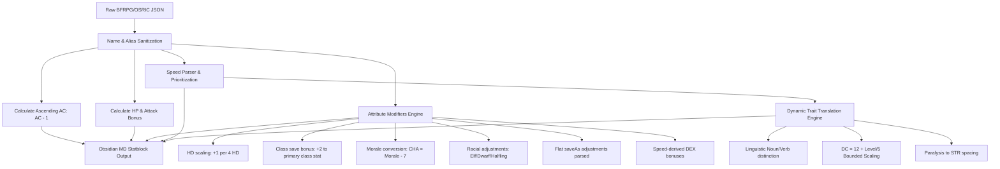

# 🌌 Obsidian Shadowdark Bestiary

Welcome to the ultimate **Shadowdark RPG** bestiary for Obsidian! This repository contains a comprehensive collection of **869 monster statblocks** (originally extracted from the BFRPG Core Rules and Field Guide) that have been **fully converted and optimized** for the **Shadowdark RPG** ruleset, specifically formatted for the [Obsidian Fantasy Statblocks](https://plugins.javalent.com/statblocks) plugin.

---

## 🌌 Premium Shadowdark Features

* **Obsidian Ready:** Pre-formatted in Markdown with clean YAML frontmatter that works plug-and-play with the *Fantasy Statblocks* plugin.
* **Complete Shadowdark Layout:** Built specifically for the `shadowdark` layout, featuring ascending AC, Level, HP, Atk Bonus, and a custom Actions / Traits hierarchy.
* **Preserved Comma-Separated Naming:** Retains original database comma-separated naming schemas (e.g., `Dragon, Ice` and `Elf Bugs, Swarm`) inside the YAML name, aliases, and vault filenames, keeping species and variants perfectly grouped together in your Obsidian folder sidebar.
* **Interactive Dice Roller Integration:** Automatically parses and appends clickable Obsidian Dice Roller blocks (e.g. `1d8+1 (`dice:1d8+1`)`) next to all dice expressions inside the YAML `damage` field and action description strings.
* **Dynamic 6-Attribute Modifiers:** Every monster features a complete `attributes` array `[STR, DEX, CON, INT, WIS, CHA]` calculated using customized Old-School OSR progression formulas (see conversion logic below).
* **Speed Mapping & DEX Bonuses:** Automatic prioritization and translation of complex movement rates (like flying and swimming) into clean Shadowdark speed classes (`near`, `near (fly)`, `double near`, `double near (fly)`), which dynamically feed back into the monster's **DEX modifier**.
* **Preceding-Word Contextual Trait Translation:** Traditional B/X saving throw categories (like *save vs. Poison*, *save vs. Spells*) have been translated into natural, grammatically flawless Shadowdark-style difficulty checks (e.g. `succeed on a DC [DC] [Attribute] check`), applied to **both** the YAML traits block and the main body paragraphs.
* **Asterisk Stripping & Clean Formatting:** Formatting symbols and asterisks (like `Gargoyle*` or `Shadow*`) have been completely stripped from monster names, aliases, and filenames for a pristine vault experience.
* **Rearchitected Initiative Modifier:** The YAML `modifier:` property maps directly to the monster's resolved **DEX modifier** for seamless compatibility with Obsidian's *Initiative Tracker* plugin.

---

## ⚙️ Monster Conversion Pipeline

Here is a visual overview of how the raw monster data is processed and converted into a premium Shadowdark statblock:

---

## 🧠 Conversion Logic & Mathematics

To preserve the authentic old-school flavor while seamlessly aligning with Shadowdark's mechanics, we implemented the following translation rules:

### 1. Armor Class (AC)
Shadowdark uses ascending AC where unarmored is base 10 (BFRPG is base 11). AC is converted via a flat offset:
$$\text{Shadowdark AC} = \text{BFRPG AC} - 1$$
*All descending AC stats have been removed.*

### 2. Attribute Modifier Calculation
Monsters default to `+0` for all 6 modifiers. We then apply these layering formulas to build the custom `attributes` array `[STR, DEX, CON, INT, WIS, CHA]`:
* **Hit Dice Level Scaling:** To represent raw power, monsters get `+1` to all six modifiers for every 4 levels (i.e. `int(level / 4)`).
* **Class Save Bonuses:** 
  * Fighter saving throws (including normal men) $\to$ **`+2 STR`**
  * Magic-User saving throws $\to$ **`+2 INT`**
  * Cleric saving throws $\to$ **`+2 WIS`**
  * Thief saving throws $\to$ **`+2 DEX`**
* **Charisma Modifier:** Derived directly from morale as $\text{Morale} - 7$ (defaults to `+0` if morale is absent).
* **Racial Save Modifiers:**
  * **Elf:** `-1 CON`, `+1 INT`, `+1 WIS`
  * **Dwarf:** `+1 STR`, `+1 CON`, `-1 CHA`
  * **Halfling:** `-1 STR`, `+2 DEX`
* **Special Hit Dice (+HP):** Monsters with a flat hit point bonus in their HD string (e.g. `3+1` or `1+2`) get an additional **`+1 CON`** modifier.
* **Speed-Derived DEX Bonuses:** Mapped directly from the resolved speed key:
  * `double near (fly)` $\to$ **`+2 DEX`**
  * `near (fly)` or `double near` $\to$ **`+1 DEX`**
  * `near` $\to$ **`+0 DEX`**
* **Flat saveAs Adjustments:** If the monster has explicit flat saving throw adjustments in the database (e.g., `+2 Poison saves` or `+2 vs. Death`), the bonus is parsed and added directly to the respective attribute (e.g., **`+2 CON`**).

### 3. Speed Prioritization
Complex, multi-movement ratings are converted into a **single prioritized speed key** for clean statblock presentation:
1. `double near (fly)` (Very fast flyer, $\ge 60$ base flight rate)
2. `near (fly)` (Standard flyer — prioritized over ground speed for maximum tactical relevance)
3. `double near` (Very fast land/swimming/burrow speed, $\ge 60$ base rate)
4. `near` (Standard movement)
*All flight-turning parenthetical distances have been stripped out to ensure parsing precision.*

### 4. Bounded DC & Grammatical Trait Translations
To ensure difficulty checks remain within Shadowdark's bounded accuracy system, B/X saving throw categories are dynamically converted using a **divide-by-5** flat scaling progression:
$$\text{DC} = 12 + \text{int}\left(\frac{\text{Level}}{5}\right)$$
This places level 1-4 monsters at the standard **DC 12** (Normal difficulty) and caps maximum epic bosses (level 40) at **DC 20**.

#### Trait & Description Sanitization
A context-aware linguistic engine scans all monster traits and description paragraphs, automatically rewriting old B/X mechanics into modern Shadowdark rules:
* **Conjugation-Aware Grammatical Replacements:**
  * *Noun form* (preceded by `a`, `the`, `their`, etc.): `"a save vs. spells"` $\to$ **`a DC [DC] INT check`**
  * *Verb form* (preceded by `they`, `must`, `to`, etc.): `"unless they save vs. magic"` $\to$ **`unless they succeed on a DC [DC] INT check`**
* **Level & HP Sanitization (Frontmatter & Stats):**
  * Old B/X special ability asterisks (`*` and `**`) and flat HP modifiers (like `+1`, `+2`, `-1`) are completely stripped from the frontmatter `level` field and the `stats` array (e.g. `5+1*` $\to$ `5`, `1-1` $\to$ `1`, `4**` $\to$ `4`).
  * Any fractional levels (like `1/2` or unicode `½`) are normalized and rounded up to `"1"` for standard Shadowdark campaign display.
  * These display adjustments preserve clean, elegant level numbers while keeping internal mathematical calculations correct.
* **Hit Dice to Levels Translation:**
  * `"hit dice"` (plural) $\to$ **`"levels"`**
  * `"hit die"` (singular) $\to$ **`"level"`**
  * `"HD"` (abbreviation) $\to$ **`"LVL"`**
* **Morale to Charisma Checks Conversion:**
  * Since Shadowdark does not use morale scores, old B/X morale mechanics are converted directly into active Charisma checks using standard DC-12 rules:
    * `"morale check"` $\to$ **`"DC 12 CHA check"`**
    * `"morale checks"` $\to$ **`"morale checks (DC 12 CHA checks)"`**
    * `"checking morale"` $\to$ **`"making a DC 12 CHA check"`**
    * `"morale rating"` / `"morale value"` $\to$ **`"CHA modifier"`**
* **Spellcaster Class Alignment:**
  * Old B/X `"Magic-User"` class terms are converted directly to Shadowdark's class standard:
    * `"Magic-User"` / `"magic-user"` (singular) $\to$ **`"Wizard"` / `"wizard"`**
    * `"magic-users"` (plural) $\to$ **`"wizards"`** (preserving correct capitalization and pluralization)
* **Vision Terminology Alignment:**
  * Traditional B/X infravision (heat-sensing sight) is converted to Shadowdark's standard darkvision:
    * `"infravision"` $\to$ **`"darkvision"`**

#### Category to Attribute Mappings:
* **vs. Poison / Death Ray / Death / Disease** $\to$ **CON check**
* **vs. Wands / Magic Wands** $\to$ **WIS check**
* **vs. Spells / Magic / Spells** $\to$ **INT check**
* **vs. Dragon Breath / Breath** $\to$ **DEX check**
* **vs. Petrify / Turn to Stone / Paralysis** $\to$ **STR check** *(Paralysis was mapped to STR to keep saving throw types mechanically balanced and spaced out).*

---

## 📦 Installation & Setup

1. **Install Plugin:** Ensure you have the **Fantasy Statblocks** plugin active in your Obsidian vault.
2. **Download files:** Download the bestiary folders (`BFRPG Core` and `BFRPG Field Guide`) from this repository.
3. **Import Layout:**
   * Create or import the **Shadowdark** statblock layout in your vault.
   * Make sure that the layout maps keys to: `ac`, `level`, `hp`, `atk_bonus`, `modifier`, `speed`, `attributes`, `traits`, and `actions`.
4. **Vault Placement:** Drop the **Bestiary** folder into your vault.
5. **Auto-Index:** Enable "Automatically Parse Frontmatter for Creatures" in your Fantasy Statblocks settings to immediately make all 869 monsters rollable!

---

## ⚖️ Attribution & Legal

This project is a derivative work based on the Basic Fantasy Role-Playing Game and OSRIC, adapted for compatibility with Shadowdark RPG.

* **Basic Fantasy Role-Playing Game Core Rules**: Copyright © 2006-2023 Chris Gonnerman.
* **Basic Fantasy Field Guide Omnibus**: Copyright © 2010-2025 Chris Gonnerman, R. Kevin Smoot, James Lemon, Matt Sluis, and Contributors.
* **Shadowdark RPG**: Copyright © 2023 Kelsey Dionne (The Arcane Library).
* **Data Source**: Sourced via [Monstro.cc](https://monstro.cc), which extracts data from the [Basic Fantasy SRD](https://www.basicfantasy.org/srd/).
